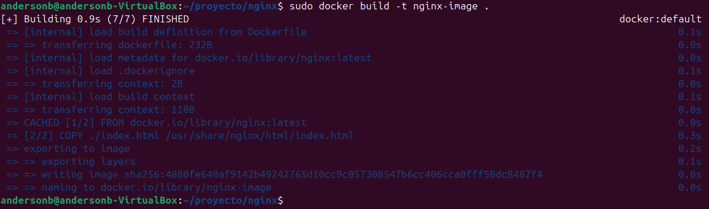
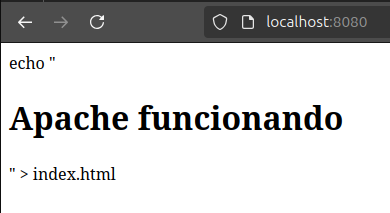

# **Bitacora Del Proyecto Final Infraestructura**

**Participantes**
Brian Zuleta Tobón (CC: 1004915766)

Anderson Betancourt (CC: 1094963718)

Miguel Antonio Zuleta Delgado (CC: 1085686073)

### CREACIÓIN DE DIRECTORIOS PARA DAR FORMA A LA ESTRUCTURA DEL PROYECTO:

### CONSTRUCCIÓN DE LA IMAGEN DE APACHE CON DOCKER (EN ESTE CASO EL "." CONSTRUYE UNA IMAGEN CON UNA ETIQUETA LATEST REFIRIENDOSE A LA VERSIÓN)

### CONSTRUCCIÓN DE LA IMAGEN DE MYSQL CON DOCKER (DE IGUAL MANERA ACTUA EL ".")

### CONSTRUCCIÓN DE LA IMAGEN DE NGINX CON DOCKER (AL IGUAL QUE CON SUS IMAGENES HERMANAS, EL "." SE ENCARGA DE ASIGNAR ETIQUETA LATEST)

### CONSTRUCCIÓN DE LA IMAGEN DE CONTENEDOR PARA APACHE USANDO PODMAN

### CONSTRUCCIÓN DE LA IMAGEN DE CONTENEDOR PARA MYSQL USANDO PODMAN

### CONSTRUCCIÓN DE LA IMAGEN DE CONTENEDOR PARA NGINX USANDO PODMAN

### VERIFICACIÓN DE LA CREACIÓN DE LAS IMAGENES CON EL COMANDO EL COMANDO: "sudo docker images"

### VERIFICACIÓN DE TODAS LAS IMAGENES DE CONTENEDORES PODMAN ALMACENADAS LOCALMENTE EN EL SI CON EL COMANDO "sudo podman images"

### USO DEL COMANDO "sudo mdadm  --detail --scan" PARA TRABAJAR CON RAIDS POR MEDIO DE LA HERRAMIENTA MDADM

### CREACIÓN DE LOS VOLUMENES FISICOS PARA LOS DISPOSITIVOS RAIDS, DE ESA FORMA LOS LVM PUEDEN ADMINISTRARLO CON EL COMANDO: "sudo pvcreate /dev/md.. Y ANEXO A ESTO EL SEGUNDO COMANDO UTILIZADO PARA LA CREACIÓN DEL GRUPO DE VOLUMENES LLAMADO "vg1" CON LOS DISPOSITIVOS MENCIONADOS.

### CREACIÓN DE LOS GRUPOS LOGICOS PARA CADA RAID QUE A SU HACE PARTE DEL VOLUMEN GROUP: EL COMANDO "sudo lvcreate -L 3g -n" TIENE COMO INSTRUCCIÓN ASIGNARLE UN TAMAÑO DE 3G PARA CADA VOLUMEN LOGICO SALVO CON EL DE nginx PUESTO A QUE NO HUBO ESPACIO LIBRE SUFICIENTE, POR LO QUE SE LE ASIGNÓ 2.5G, Y A SU VEZ SE REPITE CON DIFERENCIA DE QUE SE LLAMA DE MANERA DISTINTA ASIGNANDOLE ASÍ UN IDENTIFICADOR UNICO (EL COMO LO LLAMAMOS) PARA QUE SE PUEDA RELACIONAR DE MANERA MAS SENCILLA CON CADA IMAGEN) ANEXO A ESTO EL COMANDO "sudo vgdisplay vg1) MUESTRA INFORMACIÓN DEL VOLUMEN
 

### ASIGNARLE EL FORMATO ".ext4" AL VOLUMEN LOGICO DE APACHE (EN ESTE SE ASIGNA UN UUID [IDENTIFICADOR UNIVERSAL UNICO] AL SISTEMA DE ARCHIVOS, TAMBIEN SE GENERA UNA ESTRUCTURA QUE ALMACENA INFORMACIÓN SOBRE EL SISTEMA DE ARCHIVOS.), DE IGUAL MANERA SUCEDE LO MISMO CON MYSQL Y CON NGINX

### CREACIÓN DE LOS DIRECTORIOS EN "mnt" PARA PROCEDER CON EL COMANDO "mount" A MONTAR LA CONFIGURACIÓN DEL SISTEMA DE ARCHIVOS (LV) DE MANERA EN QUE CADA UNO QUEDE SEPARADO.

### INICIALIZACIÓN DE LOS CONTENEDORES, EN ESTE CASO EL DE MYSQL, EN EL QUE SE MONTA DESDE EL HOST, HACIA EL CONTENEDOR CON AYUDA DEL DIRECTORION ANFITRION, HACIA EL DEL CONTENEDOR, PERMITIENDO QUE LOS DATOS SE GUARDEN EN EL VL (SE ALMACENAN FUERA DEL CONTENEDOR, LO QUE PERMITE LA PERSISTENCIA), Y A SU VEZ, SE ASIGNO UN NOMBRE DISTINTIVO PARA EL CONTENEDOR

### INICIALIZACIÓN DEL CONTENEDOR DE NGINX DESDE EL SISTEMA ANFITRIÓN HACIA EL CONTENEDOR, EL "usr/share/nginx/html" PERMITE BUSCAR QUE LOS ARCHIVOS SIRVAN EN EL SERVIDOR DE NGINX, DIRECTAMENTE DESDE EL HOST, Y QUE EL CAMBIO EN LOS ARCHIVOS OCURRA EN EL SERVIDOR DE FORMA AUTOMATICA Y DE IGUAL MANERA CON EL DE APACHE

### VISUALIZACIÓN DE LA INFORMAMCIÓN QUE EL COMANDO "sudo ps podman" BRINDA DE ESTOS, LISTANDOLOS. DE ESTA FORMA, SE CREAN CONTENEDORES, ACTIVOS PARA APACHE, NGINX Y MYSQL

### VISUALIZACIÓN DE QUE APACHE CORRE

### VISUALIZACIÓN DE QUE NGINX CORRE

### VISUALIZACIÓN DE QUE MYSQL CORRE

