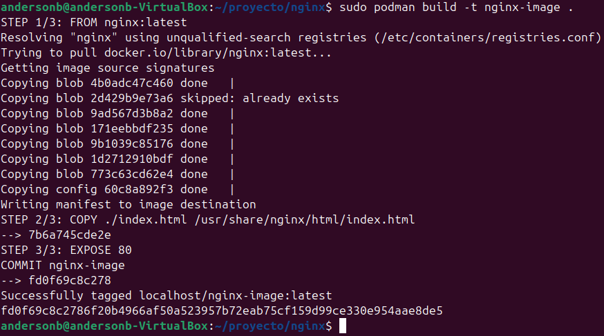

# **Bitacora Del Proyecto Final Infraestructura**

**Participantes**
Brian Zuleta Tobón (CC: 1004915766)

Anderson Betancourt (CC: 1094963718)

Miguel Antonio Zuleta Delgado (CC: 1085686073)

### CREACIÓIN DE DIRECTORIOS PARA DAR FORMA A LA ESTRUCTURA DEL PROYECTO:

### CONSTRUCCIÓN DE LA IMAGEN DE APACHE CON DOCKER (EN ESTE CASO EL "." CONSTRUYE UNA IMAGEN CON UNA ETIQUETA LATEST REFIRIENDOSE A LA VERSIÓN)

### CONSTRUCCIÓN DE LA IMAGEN DE MYSQL CON DOCKER (DE IGUAL MANERA ACTUA EL ".")

### CONSTRUCCIÓN DE LA IMAGEN DE NGINX CON DOCKER (AL IGUAL QUE CON SUS IMAGENES HERMANAS, EL "." SE ENCARGA DE ASIGNAR ETIQUETA LATEST)

### CONSTRUCCIÓN DE LA IMAGEN DE CONTENEDOR PARA APACHE USANDO PODMAN

### CONSTRUCCIÓN DE LA IMAGEN DE CONTENEDOR PARA MYSQL USANDO PODMAN

### CONSTRUCCIÓN DE LA IMAGEN DE CONTENEDOR PARA NGINX USANDO PODMAN

### VERIFICACIÓN DE LA CREACIÓN DE LAS IMAGENES CON EL COMANDO EL COMANDO: "sudo docker images"

### VERIFICACIÓN DE TODAS LAS IMAGENES DE CONTENEDORES PODMAN ALMACENADAS LOCALMENTE EN EL SI CON EL COMANDO "sudo podman images"

### USO DEL COMANDO "sudo mdadm  --detail --scan" PARA TRABAJAR CON RAIDS POR MEDIO DE LA HERRAMIENTA MDADM

